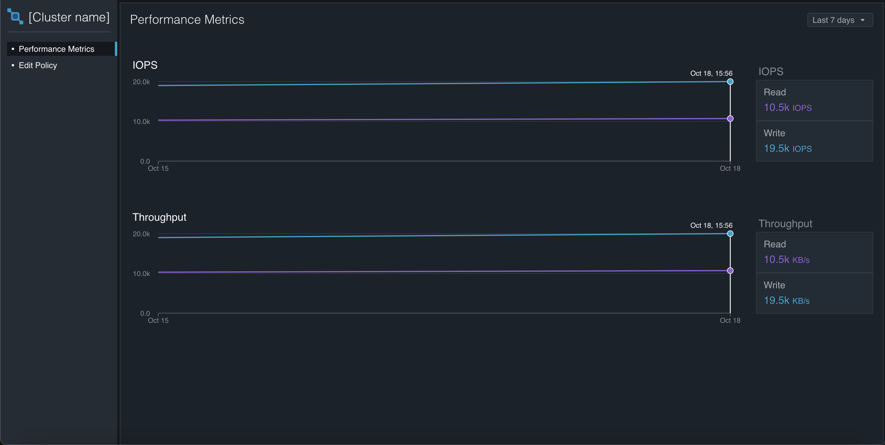
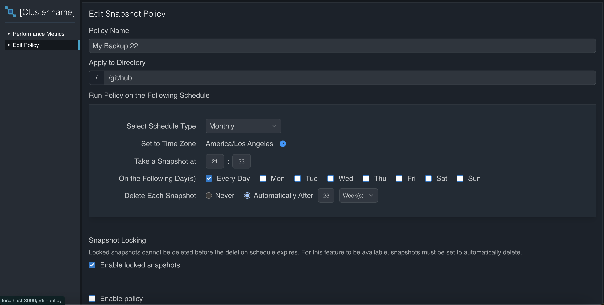

# Qumulo Cluster Management - Frontend

This repository contains the frontend implementation for the Qumulo Cluster Management web application. Built using Next.js, Tailwind CSS, and Recharts, this project enables users to monitor and manage clusters with interactive dashboards and form-based configuration.

## Table of Contents

- [Overview](#overview)
- [Features](#features)
- [Tech Stack](#tech-stack)
- [Project Structure](#project-structure)
- [Getting Started](#getting-started)
- [Design Decisions](#design-decisions)
- [Code Quality](#code-quality)
- [Screenshots](#screenshots)
- [How to Run Locally](#how-to-run-locally)
- [Conclusion](#conclusion)

## Overview

The frontend application is responsible for displaying cluster metrics such as IOPS and Throughput and providing user interfaces to manage snapshot policies. It focuses on a clean and interactive user experience with responsive layouts and time series visualizations.

## Features

- **Performance Metrics Dashboard**: Interactive graphs displaying IOPS and Throughput metrics using Recharts.
- **Snapshot Policy Management**: A comprehensive form to create and edit snapshot policies, with features like setting schedule types, locking snapshots, and automatic deletion schedules.
- **Data Fetching with React Query**: Ensures data consistency and provides caching, refetching, and optimistic updates for a smooth user experience.
- **Pixel-Perfect & Responsive Design**: Adheres closely to design specifications to ensure a polished, consistent user experience across devices.
- **Fully Functional UI Elements**: Each UI element is designed to have corresponding logic, ensuring a dynamic and interactive user experience.
- **Loading, Error, and No-Data States**: Implemented comprehensive states for loading, error, and no-data scenarios to enhance user experience.

## Tech Stack

- **Framework**: Next.js
- **Styling**: Tailwind CSS
- **Charts**: Recharts
- **Type Safety**: TypeScript
- **Data Fetching**: React Query

## Project Structure

The project is structured in a modular manner to facilitate scalability and maintainability. Key directories include:

- **`/components`**: Contains reusable UI components such as charts, buttons, forms, etc.
- **`/hooks`**: Contains custom React hooks, such as those for data fetching using React Query.
- **`/services`**: Manages API calls and schema validation using TypeScript and zod.
- **`/pages`**: Contains Next.js pages, adhering to the conventions of the framework.

## Getting Started

Follow these steps to get the frontend up and running:

1. **Clone the Repository**:
   ```bash
   git clone https://github.com/ahmadaurwahaj/qumulo-client
   cd qumolo-client
   ```

# Frontend Application

## Getting Started

1. **Install Dependencies**:

   ```bash
   npm install # or yarn install
   ```

2. **Run the Development Server**:

   ```bash
   npm run dev # or yarn dev
   ```

3. **Add .env file provided in email**

4. Open [http://localhost:3000](http://localhost:3000) to view the application.

5. **For Testing application:**
   ```bash
   npm run test
   ```

## Design Decisions

### React Query for Data Fetching

React Query is used to fetch, cache, and synchronize data between server and client efficiently. Key benefits include:

- **Automatic Caching** for consistent state management.
- **Optimistic Updates** and background refetching for a seamless user experience.
- **Error and Loading State Handling** to provide feedback to users effectively.

### Schema Validation

To ensure data integrity, **zod** is used for schema validation. This helps to:

- Validate incoming data from API responses.
- Perform client-side validations for form submissions, reducing server-side errors.

### Pixel-Perfect & Responsive Design

Tailwind CSS was utilized to create a responsive, visually appealing UI, matching the design specifications closely. This ensures a consistent user experience across various screen sizes.

### Loading, Error, and No-Data States

Comprehensive states are implemented for **loading**, **error**, and **no-data** scenarios:

- **Loading State**: Displays a spinner or loading animation to indicate data is being fetched.
- **Error State**: Gracefully handles and displays error messages if an API call fails.
- **No Data State**: Informs the user if there's no data available to display.

## Code Quality

- **TypeScript Everywhere**: Enforced strict typing with TypeScript, eliminating the use of implicit `any`.
- **Linting and Formatting**: Followed ESLint and Prettier guidelines to maintain consistent code quality.
- **Modular and Scalable**: Organized code in a modular way to allow for easy addition of new features and components.
- **No Implicit Any**: All data and API responses are strongly typed.

## Screenshots

- **Performance Metrics Dashboard**: 
- **Snapshot Policy Form**: 

## Conclusion

This frontend application is designed with scalability and maintainability in mind. It adheres to modern development practices, ensuring a clean codebase and a responsive user interface. By leveraging React Query, Recharts, and Tailwind CSS, the project achieves an optimal balance of functionality, performance, and user experience.

For any questions or discussions about the project, feel free to reach out.
